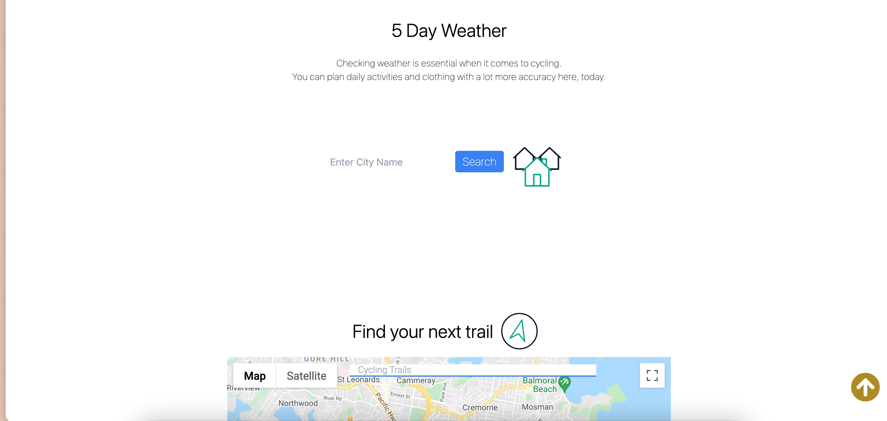

## Cyclist

## Description

We want an app that will allow users to find local places to cycle. They will be able to check their  location and show the local weather and information about cycling trails nearby. This allows the users to save time planning work out routine. 

## APIs (Third-party)

 https://maps.googleapis.com/maps/api/directions/json?origin=Disneyland&destination=Universal+Studios+Hollywood&key=YOUR_API_KEY

 http://api.weatherbit.io/v2.0/current

## Demo

## Links

* [Github](https://github.com/wl0194)
* [Live](https://wl0194.github.io/Cyclist/)

